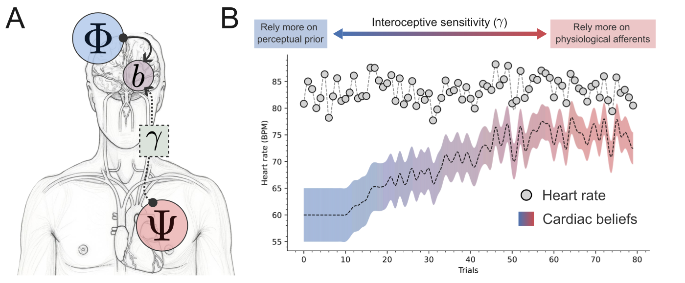
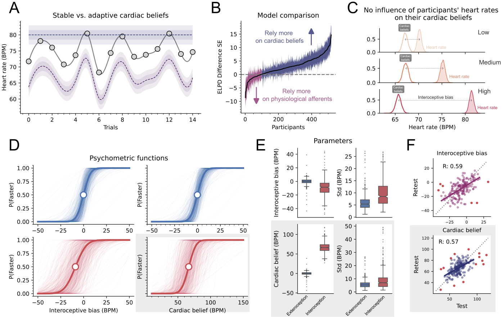
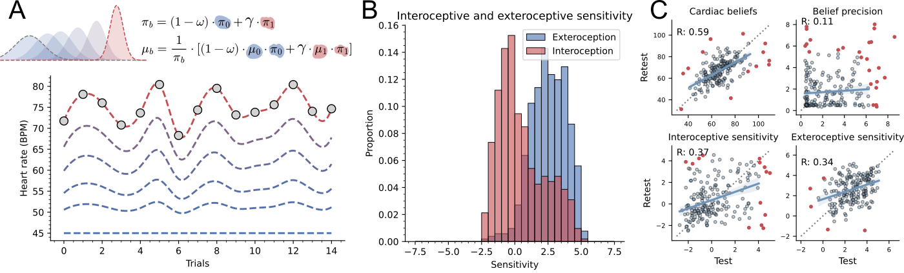
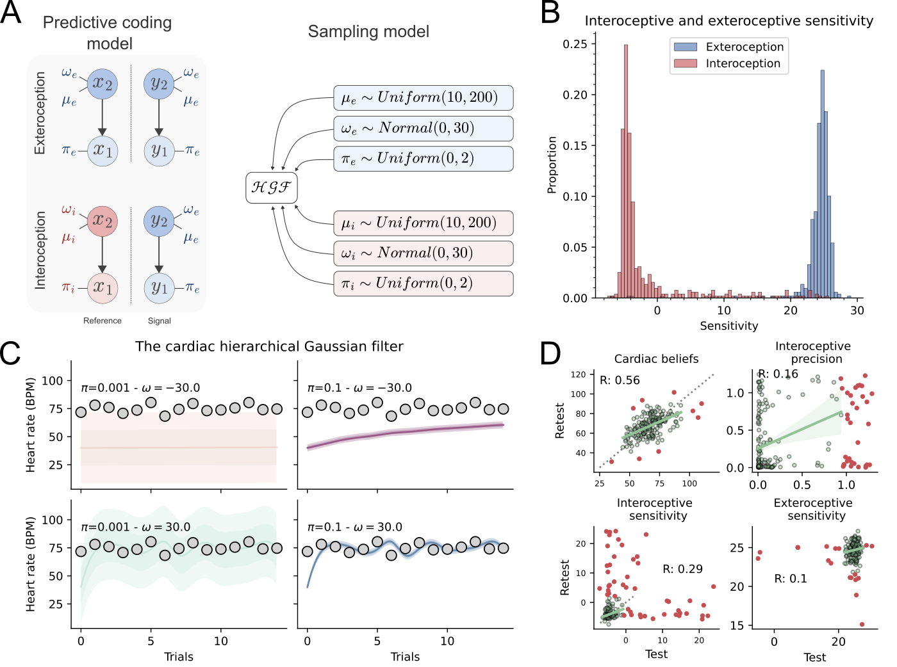
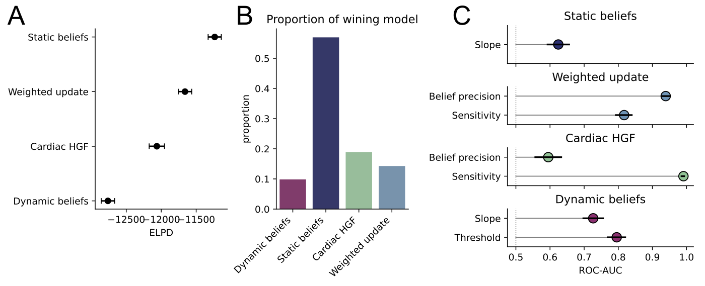

# Computational cardioception

This repository contains the code to reproduce the analyses from:

> Legrand, N., Weber, L., and Mathys, C. (2026) Cardiac belief updating from volatile physiological afferents.


We compare four computational models of cardiac interoception, fitted to the behaviour of 549 participants performing the Heart Rate Discrimination (HRD) task, and evaluate them on model evidence (ELPD), test–retest reliability, and their ability to discriminate interoceptive from exteroceptive trials.

---

## Project structure

```
.
├── code/
│   ├── run.py                            # CLI — fits the four models, one participant at a time
│   ├── merge.py                          # collects the per-participant traces into summary tables
│   ├── models/
│   │   ├── bayesian_psychophysics.py     # Model 1 — dynamic beliefs
│   │   ├── cardiac_believing.py          # Model 2 — static beliefs
│   │   ├── weighted_update.py            # Model 3 — weighted Bayesian update, static prior
│   │   ├── cardiac_hgf.py                # Model 4 — weighted Bayesian update, dynamic prior (cardiac HGF)
│   │   └── utils.py                      # psychometric helpers and Bayesian update equations
│   └── notebooks/                        # one notebook per figure panel
├── data/
│   └── hrd.csv                           # HRD task behaviour (549 participants, 2 sessions)
├── results/
│   ├── idata/                            # per-participant NetCDF traces (created by `make run-models`)
│   └── *.csv                             # summary tables consumed by the notebooks
├── figures/                              # SVG panels written by the notebooks + final figures
│   ├── fig_1.svg … fig_5.svg             # the five figures of the paper
│   └── png/                              # PNG renders used in this README
├── sources/                              # reference PDFs cited in the manuscript
├── makefile                              # entry point for every step below
├── scripts.sh                            # the two `run.py` calls issued by `make run-models`
└── pyproject.toml                        # dependencies (Python 3.12, pyhgf, PyMC, ArviZ)
```

---

## Data

`data/hrd.csv` holds the trial-level HRD data: one row per trial, with `listenBPM` (the reference
tone or the recorded heart rate), `responseBPM` (the decision tone), the binary `Decision`
(`"More"` / `"Less"`), the `Modality` (`Intero` / `Extero`), and `Confidence` ratings.

Sessions are reconstructed from the `cohort` and `task` columns:

- **session 1** — `cohort == "vmp1"` and `task == "hrd-session1"`
- **session 2** — `cohort == "vmp1"` & `task == "hrd-session2"`, *or* `cohort == "vmp2"` & `task == "hrd-session1"`

Participants with fewer than 20 or more than 160 usable interoceptive trials are dropped by
`code/run.py`, which is why the 549 participants in the file become the 518 reported in the paper.

---

## Installation

Requires **Python 3.12** and [uv](https://docs.astral.sh/uv/). Graphviz *binaries* are also needed —
`pm.model_to_graphviz` renders the graphical models in the appendix notebook.

```bash
make setup-env
```

This installs Graphviz (Homebrew on macOS, apt on Linux), installs `uv`, creates `.venv/`, and runs
`uv sync`. Activate the environment yourself afterwards:

```bash
source .venv/bin/activate
```

To register the environment as a Jupyter kernel and start JupyterLab on port 5555:

```bash
make jupyterlab
```

---

## Running the analysis

The pipeline has four stages. Each one consumes the output of the previous one, so run them in
order.

### 1. Fit the models

```bash
make run-models          # == bash scripts.sh
```

`scripts.sh` runs `code/run.py` twice, once per session, fitting all four models:

```bash
uv run python code/run.py --session 1 --model all
uv run python code/run.py --session 2 --model all
```

Each participant is fitted independently and written to
`results/idata/<model>_session<N>_<participant_id>.nc`, containing only the posterior variables of
interest plus the pointwise log-likelihood of the interoceptive trials (`bin_intero`) needed for
model comparison.

Useful flags and knobs:

- `--model` accepts `all`, `bayesian_psychophysics`, `cardiac_believing`, `weighted_update`, or
  `cardiac_hgf`, so a single model can be refitted without redoing the rest.
- Fits are **resumed by default**: a participant whose `.nc` file already exists is skipped. Pass
  `--overwrite` to force a refit.
- Parallelism is hard-coded to `mp.Pool(processes=10)` in [run.py:313](code/run.py#L313) — lower it
  on a smaller machine, since each worker runs its own NUTS chains.
- All stdout/stderr is redirected to `output.log` by `scripts.sh`.

This stage is by far the longest: four models × two sessions × ~500 participants of HMC sampling,
i.e. hours to overnight depending on the core count. The cardiac HGF is the slowest and the most
fragile — failures are caught per participant and printed as
`Cardiac HGF model FAILED for <id>: …` rather than aborting the run, so grep `output.log` before
trusting the model comparison.

### 2. Summarise the traces

```bash
make merge               # == uv run python code/merge.py
```

Walks every `.nc` file in `results/idata/`, takes the posterior mean of each parameter, and writes
one row per participant × session into:

| File | Source model |
| --- | --- |
| `results/standard_model_summary.csv` | Model 1 |
| `results/cardiac_believing_summary.csv` | Model 2 |
| `results/weighted_update_summary.csv` | Model 3 |
| `results/cardiac_hgf_summary.csv` | Model 4 |

Missing `.nc` files are silently skipped, so a partial stage 1 produces a partial — but valid —
summary table.

### 3. Produce the figure panels

```bash
make run-notebooks              # 4 notebooks at a time
make run-notebooks JOBS=1       # serial, easier to debug
```

Executes every notebook in `code/notebooks/` in place with `nbconvert`, writing SVG panels into
`figures/`. Per-notebook logs go to `logs/notebooks/`, and the target refuses to pretend success:
failures are listed with the last 25 log lines and the target exits non-zero.

Two caveats worth repeating:

- The target warns if `results/idata/` is missing or empty — the model-comparison and correlation
  notebooks read the traces directly, not just the summary CSVs, and will fail without them.
- `nbconvert --inplace` does **not** write on failure, so a failed notebook keeps its *previous*
  outputs. Any figure it was supposed to regenerate is stale, not missing.

The comparison tables (`results/model_compare.csv`, `results/model_comparison_df.csv`,
`results/reported_statistics_roc_auc.csv`) are written by the `Figure_5_*` notebooks at this stage.

### 4. Refresh the README renders

The PNGs shown below are rendered from the SVGs; regenerate them after changing a figure:

```bash
for i in 1 2 3 4 5; do
  rsvg-convert -w 1400 -b white -f png -o figures/png/fig_$i.png figures/fig_$i.svg
done
```

---

## Figures

### Figure 1

[](figures/fig_1.svg)

**Figure 1: Cardiac belief updating along the sensitivity axis.** **A.** Schematic representation of
the two sources of information influencing cardiac interoceptive beliefs (*b*), from prior
perceptual expectation (Ψ) and physiological afferents (Φ). Interoceptive sensitivity weights the
influence of afferent signals on the belief updates. **B.** Simulated belief trajectories with
increasing levels of interoceptive sensitivity. The grey dots and lines represent instantaneous
heart rates, which can be derived from RR intervals or averaged over arbitrary time windows. The
cardiac beliefs and their precision are represented with a gradient of shaded areas, from no
sensitivity (λ = 0, blue) to the highest sensitivity (λ = 1, red). Higher sensitivity (λ) increases
the influence of physiological afferents and results in covarying beliefs and physiology. When
λ = 0, cardiac beliefs are only guided by perceptual priors. When λ = 1.0, cardiac beliefs strictly
covary with physiological afferents. Note that bias and uncertainty can remain, in theory, even
under perfect sensitivity.

### Figure 2

[](figures/fig_2.svg)

**Figure 2: Behaviors at the HRD task are better explained by static cardiac beliefs.** **A.**
Simulation of instantaneous heart rate (grey dots and line), static beliefs (blue line and shaded
areas), and dynamic beliefs (purple line and shaded area). These two models represent the two
extremes of interoceptive sensitivity, where prior expectations can have an all-or-none influence.
**B.** Model comparison between static (blue) and dynamic (purple) cardiac beliefs. Static beliefs
better explain the behaviors among a majority of participants. **C.** Cardiac beliefs are stable,
despite significant fluctuation in the underlying heart rates. By splitting the trials using the two
tertiles of the subject's heart rate, we observed that cardiac beliefs (transparent distributions)
are stable compared to the objective heart rates (shaded distributions). As heart rate fluctuates
across low (yellow), medium (orange), and high (red) frequencies, beliefs hold and bias increases.
**D.** Psychometric fit along the bias for dynamic belief (left panel) and heart rate for static
beliefs (right panel). The exteroceptive trials are fitted using a dynamic model in both cases in
order to learn the bias; the functions are therefore identical. **E.** Distribution of psychometric
parameter for static (lower panel) and dynamic beliefs (upper panel). Similarly, cardiac beliefs and
exteroceptive biases in the lower left panel are coming from two different models and should not be
compared statistically. **F.** Test-retest reliability for the dynamic (purple, upper panel) and
static models of beliefs (blue, lower panel).

### Figure 3

[](figures/fig_3.svg)

**Figure 3: Cardiac beliefs as a weighted Bayesian update.** **A.** Illustration of belief trajectory
dynamics as a function of interoceptive sensitivity (λ), the logit-transformed weight of a Bayesian
update (γ). Here, the update is applied without time dependence, such that the prior expectation is
fixed and shared across trials. **B.** Discriminability of task modality using interoceptive
sensitivity scores. **C.** Test-retest reliability for key metrics of interest.

### Figure 4

[](figures/fig_4.svg)

**Figure 4: Overview of the cardiac hierarchical Gaussian filter (HGF).** **A.** Schematic
representation of the predictive coding model (left) and the graphical model used for sampling.
Interoceptive and exteroceptive trials are handled by the lower and upper parts of the network
(respectively). For each reference and decision tones/heart rate, a pair of observation nodes and a
value parent guides the belief update. **B.** The cardiac HGF can discriminate task modality with
close-to-perfect performance. **C.** Illustration of the influence of tonic volatility (ω) and input
precision on the belief trajectories. Shaded areas represent ± 1 and 2 standard deviations around
the mean. **D.** Test-retest reliability of some parameter of interest. This model can capture
cardiac belief with performance comparable to both the static belief and weighted Bayesian updates.

### Figure 5

[](figures/fig_5.svg)

**Figure 5: Comparison of four models of cardiac interoception.** **A.** Model performance assessed
by their expected log point-wise predictive density (ELPD) (Kumar et al., 2019; Vehtari et al.,
2016). A model assuming dynamic beliefs was the least efficient, while a model assuming static
beliefs was the most efficient, in coherence with what is reported in Figure 2B. Models assuming
Bayesian belief updates had intermediate scores, with the static priors eliciting better
performance. **B.** Proportion of winning models at the individual level. Static beliefs were the
best models for more than half of the participants, but the two Bayesian updates accounted for 19%
and 20% of the participants each. Dynamic beliefs could explain only 9.5% of the population's
behavior. **C.** Discriminability of task modality from each model's parameters, as the rank-based
area under the ROC curve with 95% bootstrap confidence intervals over participants (5,000
resamples). Grey ticks mark the permutation baseline obtained by shuffling the modality label within
participants.
